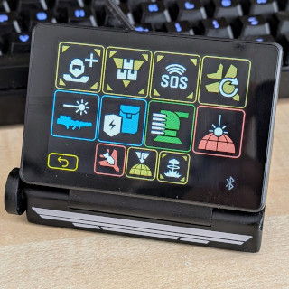
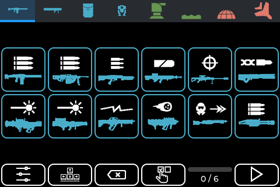
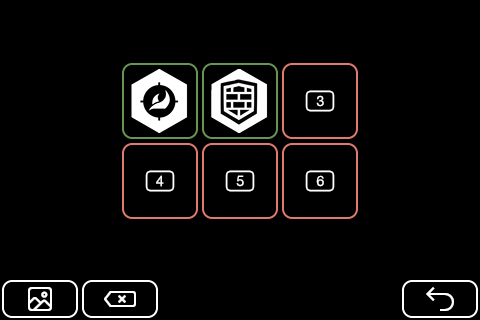
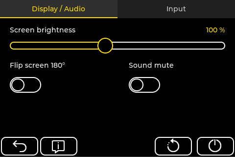
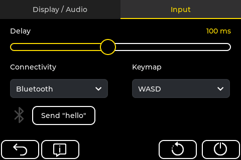
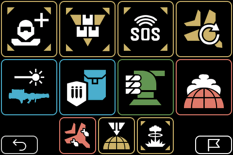
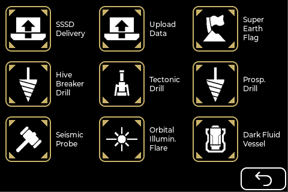
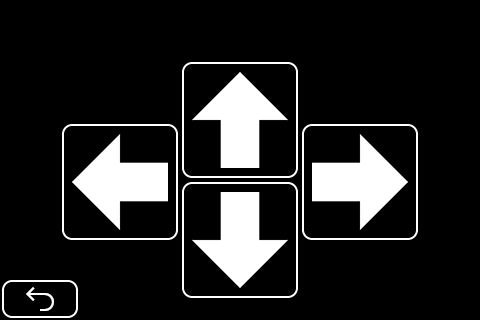

# HD2 Macropad fork to run on 7" elecrow display

This code is forked from https://github.com/unic8s/hd2_macropad and modified to run on this specific board: [Elecrow 7" basic](https://www.elecrow.com/esp32-display-7-inch-hmi-display-rgb-tft-lcd-touch-screen-support-lvgl.html)

> **note:
I didn't realize when I started this, the Elecrow board doesn't seem to follow all of the ESP32 specs, it has no usb_hid capabilities, and I was trying to use that first, but once BT was enabled, things started falling into place.  The basic board only has 4MB of flash, so it's very limiting on what can be compiled in, sound and wifi are not enabled and there is no room, unless the icons are scaled down (which likely can be done with no negative effects).  Elecrow has an advanced version of the board with 16MB of flash and some other features, I'll test with it later, I'd like to enable the sound.

Flashing this code will be the same process as the original, so follow the instructions down below.  I've tried to keep all of the original functionality.

-------------------------------------------------------------------------

A very flexible and easy-to-use macropad for HELLDIVERS&trade; 2 for live configuration on each drop into combat with individual loadouts.

Get the game on [PC](https://store.steampowered.com/app/553850/HELLDIVERS_2/), [Playstation&trade;](https://www.playstation.com/games/helldivers-2/)

Based on an affordable IoT platform device with a capacitive touchscreen it's very handy for a PC, Playstation&trade; since it's connected via Bluetooth or USB as a keyboard input device.

> HELLDIVERS and Playstation are registered trademarks of SONY INTERACTIVE ENTERTAINMENT LLC.

## Videos

[Video preview](https://www.youtube.com/watch?v=zbW8vrxIuko) on YouTube.

[Demo on PC](https://www.youtube.com/watch?v=QH1CfI5M_fw) on YouTube.

## Instructions

> [!TIP]  
> For instructions to get your own device and installation - please visit the [Wiki](https://github.com/unic8s/hd2_macropad/wiki)
> There you will also find lots of details and how to configure and use the device.

> [!IMPORTANT]  
> The device is only able to connect to the Playstation&trade; via USB.
> It's not able to connect to the Playstation&trade; via Bluetooth directly.
> We're currently working on the [BT2USB bridge](https://github.com/unic8s/bt2usb_bridge) which plugs into the USB port of a Playstation&trade; directly and connects to the HD2 Macropad via Bluetooth.

## Support

We're pleased with your feedback so far and we try to keep up with your good ideas for new features. Thanks to all of you participating on our journey.
If you enjoy the project and want to support our private work feel free to make a small donation.

## Screenshots

### Setup

### Presets & User-defined icons

### Config

### Game (example configuration)

### Mission

### Manual input - if you want to put it on your wrist for cosplayers or more intense experience while diving

## Credits and special thanks

- [Icon Set](https://github.com/nvigneux/Helldivers-2-Stratagems-icons-svg) from [@nvigneux](https://github.com/nvigneux)
- [Demo project](https://github.com/NorthernMan54/JC3248W535EN) from [@NorthernMan54](https://github.com/NorthernMan54)

## Disclaimer and copyright
> This is a private opensource project and is not associated in any kind with SONY INTERACTIVE ENTERTAINMENT LLC.
> SONY INTERACTIVE ENTERTAINMENT LLC is not responsible for any function and content that is related to this project.
> Related assets in this project are either produced by us and free to use for non-commercial usage or respectively published by the owners mentioned here.
