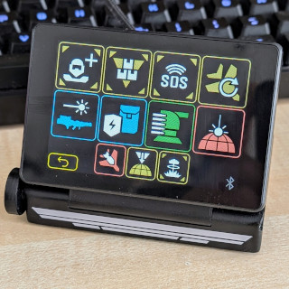
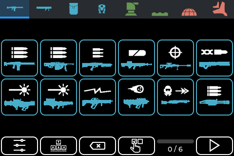
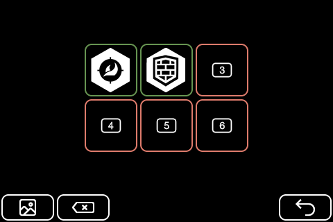
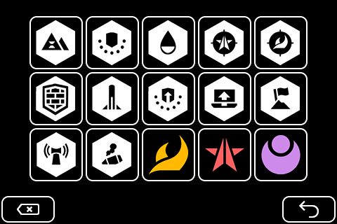
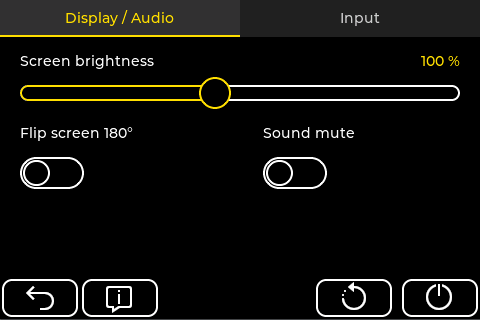
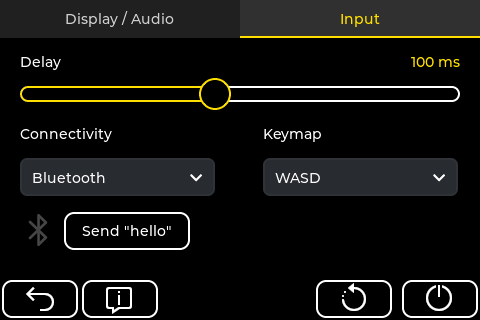
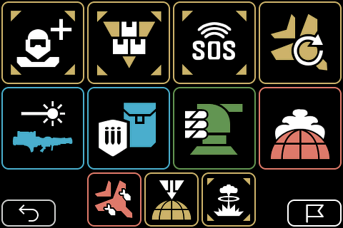
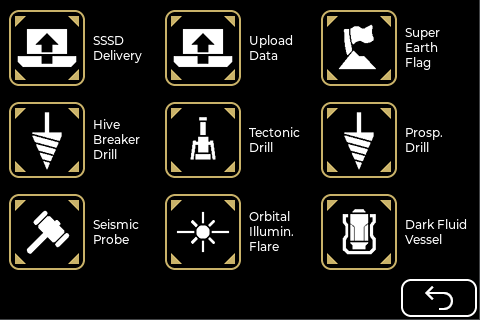
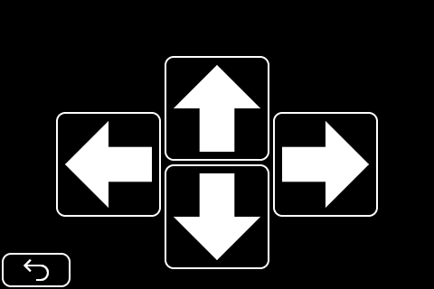

# HD2 Macropad fork to run on 7" elecrow display

This code is forked from https://github.com/unic8s/hd2_macropad and modified to run on this specific board: [Elecrow 7" Advance](https://www.elecrow.com/crowpanel-advance-7-hmi-esp32-ai-display-800x480-ai-ips-touch-screen.html)

> [!NOTE]
> I didn't realize when I started this, the Elecrow board doesn't seem to follow all of the ESP32 specs, it has no usb_hid capabilities, and I was trying to use that first, but once BT was enabled, things started falling into place.  I've moved to the advanced board from the basic, giving more capabilities, mainly more flash storage, but still no usb_hid support on the 7" panel and  I'd like to enable the sound in the future.
>
> Flashing this code will be the same process as the original, so follow the instructions down below.  I've tried to keep all of the original functionality.

Technical details of this build can be found at [README_Crowpanel_Advance](https://github.com/wokka1/hd2_macropad/blob/main/README_CROWPANEL_ADVANCE.md)

### Merging Upstream Updates

A Python script is provided to transform the upstream EEZ project (480x320) to the Elecrow 7" resolution (800x480). This allows merging new features from upstream without manually re-applying all layout changes. See [scripts/README.md](scripts/README.md) for details.  There are so many changes in the EEZ configuration between the two builds, it was easier to script changes.  If new icons are added, those will have to be manually updated more than likely.

```bash
python3 scripts/transform_eez_elecrow7.py
```

### Removing animations
The 7" screen doesn't animate well for transitions and seemed jerky and laggy.  Instead of trying to resolve that, I chose to remove them.  The issue is that when you update any changes in EEZ and compile there, it removes the animation changes, so there is a script to run to remove animations, if you choose.  So build in EEZ, then run the following script, and then build in platformIO and upload.

```bash
python3 scripts/patch_eez_animations.py
```

-------------------------------------------------------------------------



A very flexible and easy-to-use macropad for HELLDIVERS&trade; 2 for live configuration on each drop into combat with individual loadouts.

> [!NOTE]
> **The software requires this specific device [JC3248W535](https://s.click.aliexpress.com/e/_DneMCLR)**

Get the game on [PC](https://store.steampowered.com/app/553850/HELLDIVERS_2/), [Playstation&trade;](https://www.playstation.com/games/helldivers-2/)

Based on an affordable IoT platform device with a capacitive touchscreen it's very handy for a PC, Playstation&trade; since it's connected via Bluetooth or USB as a keyboard input device.

### Features

- **Cooldown Timers**: Visual countdown timers on custom stratagem buttons showing when each stratagem will be available again (format: M:SS)
- **Live Configuration**: Configure up to 6 custom stratagems per drop with individual presets
- **Multiple Input Methods**: Bluetooth, USB, or manual input mode
- **Mission-Specific Stratagems**: Quick access to mission objectives and special stratagems

> HELLDIVERS and Playstation are registered trademarks of SONY INTERACTIVE ENTERTAINMENT LLC.

## Videos

[Video preview](https://www.youtube.com/watch?v=zbW8vrxIuko) on YouTube.

[Demo on PC](https://www.youtube.com/watch?v=QH1CfI5M_fw) on YouTube.

## Instructions

> [!TIP]  
> For instructions to get your own device and installation - please visit the [Wiki](https://github.com/unic8s/hd2_macropad/wiki)
> There you will also find lots of details and how to configure and use the device.

> [!IMPORTANT]  
> The device is only able to connect to the Playstation&trade; via USB.
> It's not able to connect to the Playstation&trade; via Bluetooth directly.
> We're currently working on the [BT2USB bridge](https://github.com/unic8s/bt2usb_bridge) which plugs into the USB port of a Playstation&trade; directly and connects to the HD2 Macropad via Bluetooth.

## Support

We're pleased with your feedback so far and we try to keep up with your good ideas for new features. Thanks to all of you participating on our journey.
If you enjoy the project and want to support our private work feel free to make a small donation.

[](https://www.buymeacoffee.com/unic8)

## Screenshots

### Setup



### Presets & User-defined icons





### Config





### Game (example configuration)



### Mission



### Manual input - if you want to put it on your wrist for cosplayers or more intense experience while diving



## Credits and special thanks

- [Icon Set](https://github.com/nvigneux/Helldivers-2-Stratagems-icons-svg) from [@nvigneux](https://github.com/nvigneux)
- [Demo project](https://github.com/NorthernMan54/JC3248W535EN) from [@NorthernMan54](https://github.com/NorthernMan54)
- [Stratagem cooldown data](https://helldivers.wiki.gg/wiki/Stratagems) from [Helldivers Wiki](https://helldivers.wiki.gg/)

## Disclaimer and copyright
> This is a private opensource project and is not associated in any kind with SONY INTERACTIVE ENTERTAINMENT LLC.
> SONY INTERACTIVE ENTERTAINMENT LLC is not responsible for any function and content that is related to this project.
> Related assets in this project are either produced by us and free to use for non-commercial usage or respectively published by the owners mentioned here.
